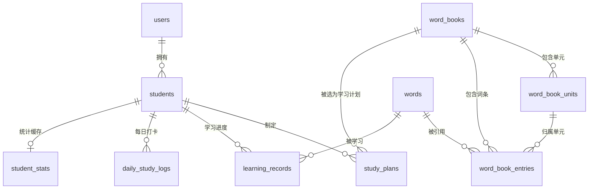

# 数据库表结构设计

技术栈：PostgreSQL 14+。所有表使用 `uuid` 主键（`gen_random_uuid()`，需要 `pgcrypto` 或 PG13+ 内建 `gen_random_uuid()`），时间戳统一 `timestamptz`。

## 1. 设计要点

- **家长账号 = 唯一登录入口**，学员档案（`students`）挂在家长账号下，学员本身不登录、不设密码，靠前端"切换身份"选中 `student_id` 存入会话。
- **单词库与学员进度分离**：`words` 是全局共享词库（同一个单词不会因为出现在多本词书里而重复存储），`word_book_entries` 负责"某个词属于哪本词书的第几单元/第几位"，`learning_records` 负责"某个学员对某个单词学到什么程度"。这样人教版和外研版共有的单词、以及"中考1600"和某教材重合的单词，不会产生脏数据。
- **复习算法落在 `learning_records` 一张表上**，采用简化版 SM-2（艾宾浩斯曲线的工程实现，逻辑比原版 SM-2 简单，够用且好维护），不用单独建"复习队列"表——复习任务=`WHERE next_review_at <= today`的一条 SQL。
- **生词本不是独立数据**，是 `learning_records.is_in_vocab_book = true` 的一个视图/筛选条件，这样"不认识"的词依然能继续参与复习调度，避免数据割裂。
- **打卡日历/统计做了轻量冗余**（`daily_study_logs` + `student_stats`），因为仪表盘要求"极简、无多余请求"，用聚合查询现算连续打卡天数在数据量大了以后不划算，提前做缓存表更省心，且不违反"避免过度设计"——这是本产品明确写在需求里的展示项，不是假设的未来需求。

## 2. ER 关系图



## 3. 建表 DDL

```sql
-- ========== 1. 家长账号 ==========
CREATE TABLE users (
    id              uuid PRIMARY KEY DEFAULT gen_random_uuid(),
    email           varchar(255) UNIQUE,          -- 邮箱和手机号至少填一个
    phone           varchar(20) UNIQUE,
    password_hash   varchar(255) NOT NULL,
    nickname        varchar(50),
    created_at      timestamptz NOT NULL DEFAULT now(),
    updated_at      timestamptz NOT NULL DEFAULT now(),
    CONSTRAINT chk_contact CHECK (email IS NOT NULL OR phone IS NOT NULL)
);

-- ========== 2. 学员档案 ==========
CREATE TYPE school_stage AS ENUM ('primary', 'junior', 'senior'); -- 小学/初中/高中
CREATE TYPE accent_preference AS ENUM ('us', 'uk'); -- 发音口音偏好

CREATE TABLE students (
    id                  uuid PRIMARY KEY DEFAULT gen_random_uuid(),
    user_id             uuid NOT NULL REFERENCES users(id) ON DELETE CASCADE,
    name                varchar(50) NOT NULL,
    avatar_url          varchar(255),
    school_stage        school_stage NOT NULL,
    grade_label         varchar(20) NOT NULL,          -- 展示用，如"五年级""初一"
    sort_order          smallint NOT NULL DEFAULT 0,   -- 侧边栏头像排序
    preferred_accent    accent_preference NOT NULL DEFAULT 'us', -- 卡片自动发音据此选择美式/英式音频
    created_at          timestamptz NOT NULL DEFAULT now(),
    updated_at          timestamptz NOT NULL DEFAULT now(),
    deleted_at          timestamptz                     -- 软删除，保留历史学习数据
);
CREATE INDEX idx_students_user ON students(user_id) WHERE deleted_at IS NULL;

-- ========== 3. 词书 ==========
CREATE TYPE word_book_category AS ENUM ('textbook', 'exam_syllabus'); -- 教材同步 / 考纲词汇

CREATE TABLE word_books (
    id              uuid PRIMARY KEY DEFAULT gen_random_uuid(),
    name            varchar(100) NOT NULL,          -- 如"人教版五年级上册""中考1600词"
    category        word_book_category NOT NULL,
    stage           school_stage NOT NULL,
    publisher       varchar(50),                    -- 人教版/外研版/北师大版，考纲词汇可为空
    cover_image_url varchar(255),
    description     text,
    total_words     integer NOT NULL DEFAULT 0,      -- 冗余字段，导入词条后回填，避免每次 COUNT
    is_published    boolean NOT NULL DEFAULT true,
    created_at      timestamptz NOT NULL DEFAULT now()
);

-- ========== 4. 词书单元（仅教材类词书需要） ==========
CREATE TABLE word_book_units (
    id              uuid PRIMARY KEY DEFAULT gen_random_uuid(),
    word_book_id    uuid NOT NULL REFERENCES word_books(id) ON DELETE CASCADE,
    unit_name       varchar(100) NOT NULL,           -- 如"Unit 3 My Family"
    order_index     smallint NOT NULL
);
CREATE UNIQUE INDEX idx_units_book_order ON word_book_units(word_book_id, order_index);

-- ========== 5. 全局单词库 ==========
CREATE TABLE words (
    id              uuid PRIMARY KEY DEFAULT gen_random_uuid(),
    spelling        varchar(100) NOT NULL,
    phonetic_us     varchar(100),                    -- 美式音标
    phonetic_uk     varchar(100),                    -- 英式音标
    audio_us_url    varchar(255),                    -- 发音音频缓存地址（CDN 或对象存储）
    audio_uk_url    varchar(255),
    definitions     jsonb NOT NULL,                  -- [{ "pos": "n.", "meaning": "苹果" }, ...]
    example_sentence      text,
    example_translation   text,
    difficulty_tag  varchar(20),                     -- 可选：core/extended 等，供筛选使用
    created_at      timestamptz NOT NULL DEFAULT now()
);
CREATE UNIQUE INDEX idx_words_spelling ON words(lower(spelling));

-- ========== 6. 词书-单词关联表 ==========
CREATE TABLE word_book_entries (
    id              uuid PRIMARY KEY DEFAULT gen_random_uuid(),
    word_book_id    uuid NOT NULL REFERENCES word_books(id) ON DELETE CASCADE,
    unit_id         uuid REFERENCES word_book_units(id) ON DELETE SET NULL,
    word_id         uuid NOT NULL REFERENCES words(id) ON DELETE CASCADE,
    order_index     integer NOT NULL                 -- 决定"每日新词"的推进顺序
);
CREATE UNIQUE INDEX idx_entries_book_word ON word_book_entries(word_book_id, word_id);
CREATE INDEX idx_entries_book_order ON word_book_entries(word_book_id, order_index);

-- ========== 7. 学习计划 ==========
CREATE TYPE study_plan_status AS ENUM ('not_started', 'in_progress', 'completed', 'paused');

CREATE TABLE study_plans (
    id                  uuid PRIMARY KEY DEFAULT gen_random_uuid(),
    student_id          uuid NOT NULL REFERENCES students(id) ON DELETE CASCADE,
    word_book_id        uuid NOT NULL REFERENCES word_books(id),
    daily_new_word_count smallint NOT NULL DEFAULT 10 CHECK (daily_new_word_count IN (10, 20, 30)),
    status              study_plan_status NOT NULL DEFAULT 'not_started',
    cursor_order_index  integer NOT NULL DEFAULT 0,  -- 已学到 word_book_entries.order_index 的哪个位置
    started_at          timestamptz,
    completed_at        timestamptz,
    created_at          timestamptz NOT NULL DEFAULT now(),
    updated_at          timestamptz NOT NULL DEFAULT now()
);
-- 同一学员同一词书只允许一条活跃计划
CREATE UNIQUE INDEX idx_plans_active_unique ON study_plans(student_id, word_book_id)
    WHERE status IN ('not_started', 'in_progress', 'paused');

-- ========== 8. 学习记录（含 SRS 复习状态，核心表） ==========
CREATE TYPE learning_status AS ENUM ('new', 'learning', 'reviewing', 'mastered');

CREATE TABLE learning_records (
    id                  uuid PRIMARY KEY DEFAULT gen_random_uuid(),
    student_id          uuid NOT NULL REFERENCES students(id) ON DELETE CASCADE,
    word_id             uuid NOT NULL REFERENCES words(id) ON DELETE CASCADE,
    study_plan_id        uuid REFERENCES study_plans(id) ON DELETE SET NULL,

    status              learning_status NOT NULL DEFAULT 'new',
    is_in_vocab_book    boolean NOT NULL DEFAULT false,   -- 点了"不认识"就置 true，生词本页面据此筛选

    -- 简化版 SM-2 字段
    ease_factor         real NOT NULL DEFAULT 2.5,        -- 难度系数，正确率高则上升，最低 1.3
    interval_days       integer NOT NULL DEFAULT 0,       -- 距上次复习的间隔天数
    repetitions         integer NOT NULL DEFAULT 0,       -- 连续记对的次数
    next_review_at      date,                              -- 下次应复习日期，NULL 表示暂不进入复习队列

    times_seen          integer NOT NULL DEFAULT 0,
    times_correct        integer NOT NULL DEFAULT 0,
    times_wrong          integer NOT NULL DEFAULT 0,

    first_learned_at    timestamptz,
    last_reviewed_at    timestamptz,
    created_at          timestamptz NOT NULL DEFAULT now(),
    updated_at          timestamptz NOT NULL DEFAULT now()
);
CREATE UNIQUE INDEX idx_records_student_word ON learning_records(student_id, word_id);
CREATE INDEX idx_records_review_queue ON learning_records(student_id, next_review_at)
    WHERE next_review_at IS NOT NULL;
CREATE INDEX idx_records_vocab_book ON learning_records(student_id) WHERE is_in_vocab_book = true;

-- ========== 9. 每日学习打卡（日历热力图 + 连续天数） ==========
CREATE TABLE daily_study_logs (
    id                  uuid PRIMARY KEY DEFAULT gen_random_uuid(),
    student_id          uuid NOT NULL REFERENCES students(id) ON DELETE CASCADE,
    study_date          date NOT NULL,
    new_words_count      integer NOT NULL DEFAULT 0,
    review_words_count   integer NOT NULL DEFAULT 0,
    created_at          timestamptz NOT NULL DEFAULT now()
);
CREATE UNIQUE INDEX idx_logs_student_date ON daily_study_logs(student_id, study_date);

-- ========== 10. 学员统计缓存（仪表盘直接读取，避免现场聚合） ==========
CREATE TABLE student_stats (
    student_id           uuid PRIMARY KEY REFERENCES students(id) ON DELETE CASCADE,
    total_words_mastered  integer NOT NULL DEFAULT 0,
    current_streak_days   integer NOT NULL DEFAULT 0,
    longest_streak_days   integer NOT NULL DEFAULT 0,
    last_study_date       date,
    updated_at            timestamptz NOT NULL DEFAULT now()
);
```

## 4. 关键业务逻辑对应的查询

**今日待复习列表**（复习中心）：

```sql
SELECT w.*, lr.*
FROM learning_records lr
JOIN words w ON w.id = lr.word_id
WHERE lr.student_id = :student_id
  AND lr.next_review_at <= CURRENT_DATE
ORDER BY lr.next_review_at ASC;
```

**生词本**（支持搜索）：

```sql
SELECT w.*, lr.times_wrong, lr.last_reviewed_at
FROM learning_records lr
JOIN words w ON w.id = lr.word_id
WHERE lr.student_id = :student_id
  AND lr.is_in_vocab_book = true
  AND w.spelling ILIKE '%' || :keyword || '%'
ORDER BY lr.updated_at DESC;
```

**今日新词**（学习室，按 study_plan 的 cursor 推进）：

```sql
SELECT w.*
FROM word_book_entries e
JOIN words w ON w.id = e.word_id
WHERE e.word_book_id = :word_book_id
  AND e.order_index > :cursor_order_index
ORDER BY e.order_index ASC
LIMIT :daily_new_word_count;
```

**简化版 SM-2 更新逻辑**（每次复习/拼写测试后，应用层计算好新值再 UPDATE，不放存储过程）：

> 拼写测试采用"三轮巩固"交互（见 [`spelling-drill-design.md`](./spelling-drill-design.md)）：同一个词允许在单轮内反复重试直到答对，因此 SM-2 的"答对/答错"判定**不是按每次按键提交计一次**，而是以"这个词的三轮是否全程零错误"作为一次判定事件——三轮全部一次通过算「答对」，只要有任意一轮出现过错误重试就算这个词本次「答错」。`times_correct`/`times_wrong` 仍按实际按键提交次数累加，用于展示"正确率"等统计，但不影响下面的 SRS 分支选择。

- 答对：`repetitions += 1`；`interval_days = repetitions == 1 ? 1 : repetitions == 2 ? 3 : round(interval_days * ease_factor)`；`ease_factor = max(1.3, ease_factor + 0.1)`
- 答错：`repetitions = 0`；`interval_days = 1`；`ease_factor = max(1.3, ease_factor - 0.2)`；`is_in_vocab_book = true`
- 两种情况都更新 `next_review_at = CURRENT_DATE + interval_days`，`times_seen += 1`，对应 `times_correct`/`times_wrong += 1`（按实际提交次数累加）。

**打卡与连续天数**：应用层在每次学习/复习提交后 upsert `daily_study_logs`，随后重算 `student_stats.current_streak_days`（若 `last_study_date = today - 1` 则 `+1`，若 `= today` 不变，否则重置为 1），并同步刷新 `longest_streak_days`。

## 5. 后续可扩展但本期不建的表

- `parent_notifications`（家长提醒/周报）——PRD 未要求，不建。
- `word_audio_cache`——发音音频先直接存 URL 在 `words` 表即可，等接入的免费 API 出现失效/限流问题，再拆出独立的音频缓存表。
